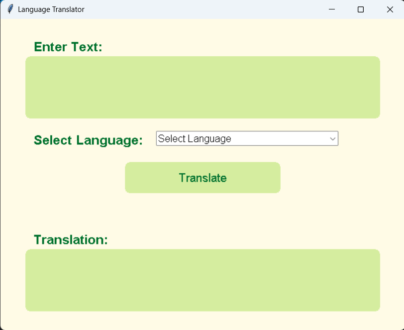
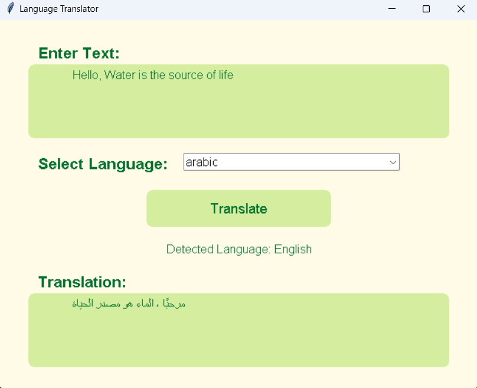

# Translation Tool


## Overview

This is a simple and efficient translation tool built using the `googletrans` library and API. The tool offers a user-friendly interface, making it easy for users to translate text between different languages. The app also detects the language automatically and provides seamless translations.

## Features

- **Powered by Google Translate API:** The tool leverages the `googletrans` library for reliable translations.
- **User-Friendly Interface:** The UI is intuitive and easy to navigate, ensuring a smooth user experience.
- **Language Detection:** Automatically detects the input language and provides accurate translations.


## Screenshots

Here’s a preview of the app:





## Usage

1. Run the application:
    ```bash
    python main.py
    ```
2. Enter the text you want to translate.
3. Choose your desired language or let the app automatically detect the language.
4. You can directly run the executable file located in /dist if you are using Windows 
## Dependencies

- `googletrans==4.0.0-rc1`
- `tkinter` (for GUI)

## Contributing

Feel free to submit issues or pull requests if you find any bugs or want to contribute enhancements.

## License

This project is licensed under the MIT License - see the [LICENSE](LICENSE) file for details.

---

Enjoy using this translation tool, and feel free to share your feedback!

